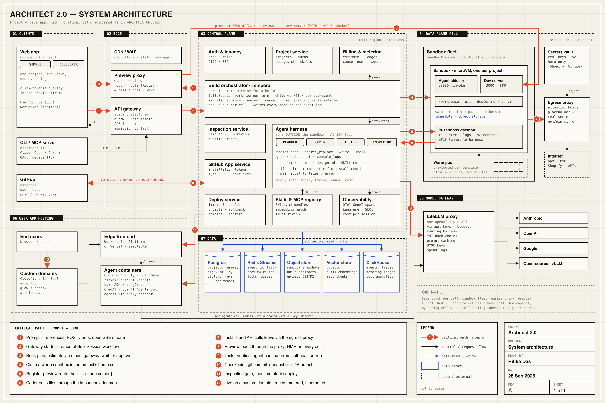

# Architect 2.0: technical architecture

Architect 2.0 turns a prompt and a few screenshots into a working agentic app, such as a website plus AI agents, on a live URL. It serves two kinds of user in one project. A founder sees plain language. A developer sees code, diffs, a terminal and agent traces. The system has four layers. A **control plane** holds users, projects, billing and the build workflow. An **agent harness** plans and writes code. A regional **data plane** runs one isolated sandbox per project. A separate **hosting layer** runs the finished apps. Three proxies stand between them: one routes previews, one routes model calls, and one keeps secrets out of generated code. Every part sits behind an interface, so we can swap any vendor without a rewrite.



*The red arrows are the critical path from prompt to live app. Their numbers match the steps below. The source is [architecture.svg](architecture.svg).*

---

## 1. Design principles

1. **The agent loop lives outside the sandbox.** The harness runs in the control plane. It reaches into the sandbox through a small daemon. If generated code crashes the sandbox or runs out of memory, the agent survives and can repair it. Emergent learned this the hard way. They moved their agent loop out of the pod after out-of-memory failures ([Emergent](https://emergent.sh/blog/real-environments-for-ai-agents-and-why-we-bet-on-kubernetes)).
2. **Generated code never holds a real secret.** The sandbox and the deployed app get placeholders. An egress proxy swaps in the real key on the way out. Replit works the same way ([Replit](https://replit.com/blog/defense-in-depth-how-replit-secures-every-layer-of-the-vibe-coding-stack)). So does Cloudflare's outbound auth for sandboxes ([Cloudflare](https://blog.cloudflare.com/sandbox-auth/)).
3. **Every vendor sits behind an interface.** That covers `SandboxProvider`, `ModelGateway`, `DeployTarget`, `GitProvider` and `AgentRuntime`. Lovable depends on one sandbox vendor and says so: "any sandbox outage takes us offline" ([Modal](https://modal.com/blog/lovable-case-study)). We want a second provider on day one.
4. **One event log drives both views.** The harness emits structured events. The Simple view and the Developer view are two renderers of the same stream. We never build a feature twice.
5. **The user never pays for the agent's own mistakes.** Every model call is tagged with its cause: `user` or `agent`. Billing charges only for `user`. This is a data model decision, not a refund policy.
6. **Durable by default.** A build is a workflow, not a request. It survives deploys, pod restarts and a closed laptop.
7. **Ask before assuming.** The Brief step is part of the pipeline, not a chat nicety. A question costs about 1% of a wrong build.

---

## 2. Prompt → live app, step by step

The walkthrough uses the prototype's sample project: the **Glow & Co. support desk**, built for a small skincare brand. It has a customer chat in English and Hindi, a team inbox, and three agents. The Refund helper approves refunds under ₹1,500 and escalates the rest. Shopify is read-only.

Events stream to the browser over **SSE** (Server-Sent Events: a one-way HTTP stream from server to browser that reconnects on its own). Every event has a `seq` number. On reconnect the browser sends `Last-Event-ID`, and the gateway replays what it missed from the event log.

| # | Step | Services and messages |
|---|---|---|
| ① | **Prompt in** | The web app uploads the screenshots to object storage through a presigned URL. It then sends `POST /v1/projects/{id}/turns` with the prompt and file keys, and opens `GET /v1/projects/{id}/events` (SSE). The API gateway checks the session, the tenant's rate limit and the concurrency cap. |
| ② | **Workflow starts** | The Project service records the turn. The gateway starts a Temporal workflow, `BuildSession(projectId, turnId)`. The turn id is the idempotency key, so a double-click cannot start two builds. Event: `turn.accepted`. |
| ③ | **Brief, plan, estimate** | The Planner sub-agent calls the model gateway. A vision model reads the screenshots and emits `brief.read` events ("warm cream background, #F4EDE2"). The Planner then asks up to five questions (`brief.question`). The Skills registry suggests add-ons (`skill.suggested`). The user's answers and rejections come back as workflow signals. The Planner writes `design.md` and a plan. The Billing service prices the plan (`estimate.ready`: 12–18 min, 140–190 credits). The workflow then waits for an `approve` signal. Nothing is built before approval. |
| ④ | **Sandbox claim** | A workflow activity calls `SandboxProvider.claim(template="next-agent", cell=home)`. A pre-booted sandbox comes from the warm pool in about a second. The repo is cloned, or restored from the last snapshot. The in-sandbox daemon starts. Event: `sandbox.ready`. |
| ⑤ | **Preview route** | The orchestrator writes a route to Redis: `3000-a7f2.archpreview.app → {sandboxId, port 3000, cell, token}`. Event: `preview.ready`. |
| ⑥ | **Code** | The Coder sub-agent runs as a child workflow. Every tool call, such as `search_replace`, `write_file` or `exec("npm run dev")`, goes to the daemon over an mTLS tunnel (a connection where both sides prove who they are). Each edit emits `file.diff`. The Simple view shows "Building the customer chat". The Developer view shows the diff. |
| ⑦ | **Install and outbound calls** | `npm install` and `pip install` leave the sandbox through the egress proxy and hit a regional package mirror. A Shopify call carries a placeholder token. The proxy swaps in the real token from the vault. |
| ⑧ | **Live preview** | The web app's preview iframe loads `https://3000-a7f2.archpreview.app`. The preview proxy looks up the host in Redis and forwards it through the cell tunnel to the dev server. Hot reload (HMR) runs over a WebSocket through the same path. The click-to-edit overlay loads inside the iframe. |
| ⑨ | **Verify and self-heal** | The Tester runs typecheck, build, Playwright flows and the agent eval set. It reads console logs and takes screenshots. A failure enters the self-heal ladder (Section 3.4). Fixes for errors the agent caused are logged `cause=agent` and cost 0 credits. Event: `fix.applied {billable:false}`. |
| ⑩ | **Checkpoint** | When the turn is green, the orchestrator makes a checkpoint. That is a git commit, a sandbox filesystem snapshot to object storage, and a database branch. The GitHub App service pushes the commit to the user's repo. Event: `checkpoint.created {rev:"B"}`. |
| ⑪ | **Inspect and deploy** | The user presses Launch. The Inspection service runs static analysis, an LLM review and runtime probes. "Must fix" findings block the deploy. The Deploy service builds immutable artifacts. The frontend goes to the edge. Each agent becomes an OCI image (a standard container image) on Cloud Run. Secrets are bound as placeholders. The custom domain is attached. Event: `deploy.live`. |
| ⑫ | **Running** | An end user opens `glow-support.architect.app`. The frontend calls the agent containers through `/invoke`. The agents call models through the LLM gateway with a scoped virtual key, so the owner's usage is metered and capped. Traces flow to observability. The builder sandbox hibernates after 10 idle minutes. |

**What the user sees during all this.** In Simple view: "Setting up your project", then "Caught my own mistake: the chat didn't scroll. Fixed it. Free." In Developer view: `sandbox.claim(template=next-agent) · warm pool hit · 1.2s` and the patch to `ChatWindow.tsx:41`. It is the same event, rendered twice.

**Follow-up turns** repeat steps ②, ⑥, ⑨ and ⑩ against the running sandbox. Steps ③ to ⑤ run only when needed. A small request like "make the button sage" skips planning. A router model decides which path to take.

---

## 3. Components

Each component below gives what it does, the choice, why, the main alternative we rejected, and how it talks to its neighbours.

### 3.1 Web app and API gateway

**What.** A React single-page app is the builder UI. The API gateway is the single front door for the web app, the CLI and the MCP server.

**Choice.** The web app is static assets on a CDN (Cloudflare). The gateway is a stateless Go or Node service on Kubernetes. It handles authentication, per-tenant rate limits, **admission control** (deciding whether a new build may start now or must queue) and SSE fan-out.

**Why.** SSE is plain HTTP. It passes corporate proxies, reconnects on its own, and replays with `Last-Event-ID`. Almost all build traffic flows one way, from server to browser. User actions are ordinary POSTs.

**Rejected.** WebSockets for everything. They need sticky sessions and custom reconnect logic, and some enterprise networks block them. We use a WebSocket only for the interactive terminal, and HMR uses one inside the preview.

**Talks to.** Auth (session check), Project service (CRUD), orchestrator (start workflow, send signals), and Redis Streams (reads the event log to feed SSE).

### 3.2 Auth and tenancy

**What.** Users, organisations, roles (owner, editor, viewer), SSO for enterprise.

**Choice.** An OIDC identity provider (managed, e.g. WorkOS or Auth0 for SSO, or Supabase Auth in v1). A tenant id is carried on every request and every row. Postgres row-level security (RLS: the database itself refuses rows from another tenant) is the backstop.

**Why.** Lyzr sells to enterprises. SSO and a view-only role are table stakes, and the current product has no view-only role. RLS means one missed `WHERE` clause cannot leak another company's project.

**Rejected.** A separate database per tenant from day one. It gives stronger isolation but costs a lot to run at thousands of tenants. We offer it as a paid VPC tier instead.

### 3.3 Control plane: Project service and Build orchestrator

**Project service.** It owns projects, turns, briefs, `design.md`, installed skills, revisions and deploy records. Plain CRUD over Postgres.

**Build orchestrator.** It runs every build as a **Temporal** workflow. Temporal is a durable workflow engine: it records every step, so a workflow resumes exactly where it stopped after a crash. One `BuildSession` workflow runs per turn. Each sub-agent is a child workflow. Each tool call, sandbox claim, checkpoint and deploy is an activity with its own timeout and retry policy. User actions arrive as signals: `approve`, `answer`, `cancel`, `user_edit`.

**Why Temporal.** A build is 10 to 30 minutes of mixed LLM calls, sandbox work and waits for a human. That is a workflow, not a web request. Temporal gives retries, timeouts, human-in-the-loop waits and a full history for free. Emergent runs its agent on Temporal at more than a billion actions a month, with sub-agents as child workflows ([Temporal](https://temporal.io/resources/case-studies/emergent)).

**Rejected.** LangGraph as the core orchestrator. It is good for agent graphs inside one process. It does not give us durable timers, cross-service retries or week-long waits. We still support LangGraph as a framework for *users'* agents (Section 3.12). We also rejected a plain job queue (BullMQ, Celery). We would end up rebuilding Temporal badly.

**Talks to.** It is started by the gateway. It calls the harness, the SandboxProvider, the GitHub App service, the Inspection and Deploy services, and Billing. It writes every step to the event log.

### 3.4 Agent harness

**What.** The loop that plans, writes and fixes code. It runs as Temporal activity workers in the control plane and uses the Vercel AI SDK for model calls and tool calling.

**Sub-agents.**

| Sub-agent | Job | Default model class |
|---|---|---|
| Planner | Reads references, asks questions, writes `design.md` and the plan | Frontier (e.g. Claude Opus class) |
| Coder | Multi-file edits | Strong mid-tier (e.g. Sonnet class) |
| Tester | Runs builds, Playwright, evals; reads logs and screenshots | Mid-tier + vision |
| Inspector | Security and taste review | Frontier for review, small for triage |

**Tools.** `read_file`, `search_replace`, `write_file` (for new files only), `grep`, `shell`, `install`, `console_logs`, `screenshot`, `web_search`, plus tools from installed skills and MCP servers.

**Diff edits, not rewrites.** The main edit tool is search-and-replace on exact lines. Full-file writes are for new files. Rewriting whole files is slow, costs output tokens, and quietly drops code. Lovable is reported to use line-based search-replace as its main tool (secondary source).

**Context.** The stable prefix is the system prompt, the tool definitions, `design.md`, the active `SKILL.md` summaries, and a **repo map**. A repo map is a compact outline of every file's symbols, built with tree-sitter, as Aider does. Keeping this prefix stable makes prompt caching work (Section 3.5). Long histories are condensed after about 80 events, as OpenHands does ([OpenHands](https://docs.openhands.dev/openhands/usage/architecture/runtime)).

**Taste enforcement.** `design.md` is not a suggestion. The verify step runs a lint rule that rejects colours, fonts and radii missing from the tokens file. The Inspector compares a screenshot against `design.md` with a vision model. A "not another AI app" rule flags purple gradients, emoji icons and filler copy.

**Self-heal ladder.** Each error gets a signature (error type + file + normalised message). Then:
1. **Deterministic fixers first.** Missing import, lint autofix, a missing dependency. No LLM.
2. **Small fixer model.** A cheap model with the error and the surrounding 60 lines. v0 runs a fine-tuned "AutoFix" model in under 250 ms and reports raw LLM code errs about 10% of the time ([Vercel](https://vercel.com/blog/v0-composite-model-family)).
3. **Main model** with the full context.
4. **Stop and explain.** After 3 attempts per signature, or about 15 agent steps in a turn, the agent stops. It reverts to the last checkpoint and tells the user what it tried in plain language.

**Retry budgets** bound our cost of free fixes. The loop cannot run all night. Claude Code users have reported a $6k overnight loop (competitor notes).

**Metering rule for free fixes.** An error is `cause=agent` if it first appears after an agent edit and before the user's next message. An error after a user's manual edit, or a new request, is `cause=user`. The harness stamps every model call with `{turnId, subAgent, cause, model, tokens}`.

**Estimate before building.** The Planner outputs plan nodes (a page, an agent, an integration), each with a size class. The estimator is a regression over our own ledger: past tokens and minutes per node type, times current model prices. It shows a p50–p90 range. If a build crosses p90, the workflow pauses and asks. No platform in our research shows a cost estimate before building (competitor notes).

**Rejected.** A single monolithic agent. Sub-agents let us route each job to a cheaper model and keep each context small.

**Talks to.** The orchestrator (as activities), the model gateway (all LLM calls), the sandbox daemon (all tool calls), the Skills registry (SKILL.md), observability (spans).

### 3.5 Model gateway

**What.** One OpenAI-compatible endpoint for every model call. It serves both the harness *and* the apps users deploy.

**Choice.** **LiteLLM Proxy**, self-hosted, per region. The harness calls it through the Vercel AI SDK. LiteLLM gives virtual keys, per-key budgets, rate limits, fallback chains, spend logs, and a common format for prompt caching across providers ([LiteLLM](https://docs.litellm.ai/docs/completion/prompt_caching)).

**Routing.** By task, not by user whim. Planning uses a frontier model. Code uses a strong mid-tier model. One-line fixes and summaries use a small model. Users can pin a model per project, and the settings show the routing table.

**Fallbacks.** Each route has a chain, e.g. Anthropic → Anthropic on a second cloud (Bedrock or Vertex) → OpenAI. Vercel reports its gateway's fallbacks rescued 3.5% of requests ([Vercel AI Gateway](https://vercel.com/docs/ai-gateway)).

**Caching.** Anthropic needs explicit cache breakpoints (writes cost 25% more, reads 90% less). OpenAI caches prefixes automatically. Gemini has both. The harness keeps the prefix stable, and cache hit rate is a tracked KPI. Section 5 shows it roughly halves the cost of a build.

**BYOK** (bring your own key). An enterprise can store its own provider key in the vault. LiteLLM routes that tenant's calls with it. We still meter tokens but do not bill them.

**For users' apps.** A deployed agent gets `OPENAI_BASE_URL` pointing at the gateway and a virtual key scoped to that app, with a monthly cap. The app owner can change the model without touching code.

**Rejected.** OpenRouter: it adds a fee and routes data through a third party, which is hard for Indian data residency. Calling providers directly from the harness: it scatters retries, keys and metering across the code.

### 3.6 Sandboxes

**What.** One isolated Linux machine per active project. It runs the dev server, the user's agents during development, and the build tools.

**The interface.**

```ts
interface SandboxProvider {
  claim(template: string, opts: { projectId: string; cell: string; restoreFrom?: SnapshotRef }): Promise<Sandbox>
  exec(id: string, cmd: string, opts?): AsyncIterable<LogLine>
  expose(id: string, port: number): Promise<TunnelRef>
  snapshot(id: string, kind: 'fs' | 'memory'): Promise<SnapshotRef>
  pause(id: string): Promise<void>
  resume(id: string): Promise<Sandbox>
  destroy(id: string): Promise<void>
}
```

**Launch choice: E2B primary, Modal secondary.** E2B runs Firecracker **microVMs** (tiny virtual machines that boot in well under a second). It supports pause and resume of filesystem *and* memory. Pausing takes about 4 s per GiB and resuming about 1 s ([E2B](https://e2b.dev/docs/sandbox/persistence)). Modal uses **gVisor** (a user-space kernel that intercepts system calls, so code never talks to the host kernel directly). It has filesystem snapshots kept 30 days and memory snapshots kept 7 days ([Modal](https://modal.com/docs/guide/sandbox-snapshots)). Lovable runs on Modal at 20,000 concurrent sandboxes ([Modal](https://modal.com/blog/lovable-case-study)). Two vendors behind one interface means one vendor's outage is not ours.

**At scale: our own GKE + gVisor with warm pools.** Past roughly 5,000 concurrent sandboxes, per-second vendor pricing costs more than running our own nodes. We move to Kubernetes on GKE with the gVisor runtime and the `SandboxWarmPool` resource from kubernetes-sigs/agent-sandbox ([GitHub](https://github.com/kubernetes-sigs/agent-sandbox)). Emergent runs a similar setup: a pod per session, starting in under 8 s with a warm pool, at more than 30,000 concurrent ([Emergent](https://emergent.sh/blog/real-environments-for-ai-agents-and-why-we-bet-on-kubernetes)).

**Lifecycle.**

| State | Meaning | Cost |
|---|---|---|
| `warm` | Pre-booted from a template, unassigned | Pool overhead |
| `running` | Claimed, dev server up | Full |
| `paused` | Memory + FS snapshot after 10 min idle; resumes in ~1 s | Storage only |
| `hibernated` | After 24 h: FS snapshot in object storage, memory dropped; resumes in seconds | Storage only |
| `destroyed` | Project deleted, or 30 days idle; git remains the source of truth | None |

Emergent warns that "just keep pods around" wrecks the bill. Hibernation is how we avoid that.

**Templates.** `next-agent` (Next.js + Python agent runtime), `vite-react`, `python-agent`. Each has dependencies pre-installed, so a claim skips the slow first `npm install`.

**Rejected.** WebContainers, which run Node inside the browser (used by Bolt, [GitHub](https://github.com/stackblitz/bolt.new)). They have no real Python, so they cannot run LangGraph or CrewAI agents. Plain Docker containers (e.g. Daytona's default): they are fast, but they share the host kernel, which is weak isolation for untrusted generated code.

**Talks to.** The orchestrator (claim, snapshot, pause), the harness through the daemon, the preview proxy through a tunnel, the egress proxy for all outbound traffic.

### 3.7 Frontend ↔ sandbox

Three channels connect the browser to a sandbox. The browser never talks to a sandbox directly.

1. **Build events: SSE from a durable event log.** The harness writes events to Redis Streams (per project), and Temporal history is the backup. The gateway tails the stream. An event looks like this:

   ```json
   { "seq": 412, "type": "fix.applied", "actor": "coder", "billable": false,
     "simple": "Caught my own mistake: the chat didn't scroll. Fixed it.",
     "dev": { "file": "components/ChatWindow.tsx", "line": 41, "patch": "…", "credits": 0 } }
   ```

   The Simple view renders `simple`. The Developer view renders `dev`. The `simple` text is templated for common events. A small model writes it for the rest.

2. **Terminal: WebSocket.** Gateway → cell → daemon PTY (a pseudo-terminal). Opened only in Developer view.

3. **Preview: HTTP + HMR WebSocket** through the preview proxy (Section 3.8).

**The in-sandbox daemon.** A small signed binary, modelled on the OpenHands action execution server. It exposes `fs.read/write/patch`, `exec`, `logs.tail`, `screenshot` (headless Chromium), and `ports`. It dials *out* to the cell's tunnel broker over mTLS. The sandbox has no inbound ports.

**Click-to-edit.** In development builds, a Vite/SWC plugin stamps each JSX element with `data-arch-src="app/chat/page.tsx:41:7"`. An overlay script in the iframe highlights elements on hover and sends the source location to the parent page with `postMessage`. Style-only changes, such as a colour, text or spacing, are applied as a direct AST edit by the daemon. No LLM, 0 credits, and a revision still gets saved ("You changed the chat button to sage"). Larger changes go to the Coder with the exact file and line as context.

### 3.8 The three proxies

This is where each proxy sits and what it does.

```
                  ┌────────────── Control plane ───────────────┐
 Browser ─①─▶ API gateway ─▶ Orchestrator ─▶ Harness ──③──▶ [2] LLM GATEWAY ──▶ Anthropic
    │                 │                         │                (LiteLLM)          OpenAI
    │                 ⑤ route in Redis          ⑥ tool calls            ▲           Google
    │                 ▼                         ▼                      │           vLLM
    └─⑧─▶ [1] PREVIEW PROXY ──tunnel──▶ ┌──── Sandbox ────┐           │ virtual key
          *.archpreview.app             │ dev server :3000 │───────────┘ (app agents)
                                        │ agent sidecar    │
                                        │ daemon           │──⑦──▶ [3] EGRESS PROXY ──▶ npm, PyPI,
                                        └──────────────────┘        (allowlist +        Shopify, APIs
                                                                     secret swap) ◀── vault
```

**[1] Preview reverse proxy.** It sits at the edge, on its own registrable domain, `*.archpreview.app`, which is listed on the Public Suffix List. That list tells browsers each subdomain is a separate site. One user's preview then cannot read another's cookies, and cannot phish on our main domain. Hostnames follow `{port}-{sandboxId}.archpreview.app`, the same pattern Cloudflare uses ([Cloudflare](https://developers.cloudflare.com/sandbox/concepts/preview-urls)). On each request it: (a) parses the host, (b) looks up `{sandboxId → cell, tunnel, owner, visibility}` in Redis, (c) checks the preview token or the user's session for private previews, (d) wakes the sandbox if it is paused and holds the request for about a second, (e) forwards HTTP and upgrades WebSockets for HMR. Built as a Cloudflare Worker in front of an Envoy tunnel broker in each cell.

**[2] LLM gateway.** It sits between everything that calls a model and the providers: the harness, and users' deployed agents. It holds the provider keys, enforces budgets, routes, falls back, caches, and writes the spend log that billing reads (Section 3.5).

**[3] Egress proxy with secret injection.** It sits at the boundary of each sandbox and each deployed agent container. All outbound traffic goes through it. It does three things:
- **Allowlist.** During `npm install`, package registries are open, served through a regional mirror. After install, only hosts the project declared are allowed (`*.myshopify.com`, `api.lyzr.ai`). This limits data theft by a malicious package, and abuse like crypto-mining.
- **Secret swap.** App code holds `SHOPIFY_TOKEN=arch_ph_7f2…`. When a request to `glow.myshopify.com` carries that placeholder, the proxy replaces it with the real token from the vault. The real key never enters the sandbox, the git repo, or the logs. A leaked `.env` is worthless.
- **Audit.** Every outbound call is logged against the project. Inspection shows it as "Your Shopify key never touches the app".

**Rejected.** Putting real secrets in environment variables, which is the industry default. Generated code logs them, commits them, and sends them to the browser. We cannot review every line an agent writes, so we remove the secret from the code instead.

### 3.9 GitHub integration

**Choice. A GitHub App**, not an OAuth app. The user installs it on chosen repos only. We mint **installation tokens** that expire after 1 hour and carry only `contents:write`, `pull_requests:write` and `metadata:read`. Webhooks tell us about `push`, `pull_request` and `installation` events. Lovable integrates the same way ([Lovable](https://docs.lovable.dev/integrations/github)). User OAuth is used only to credit commits to the right person.

**Two modes.**
- **Branch mode** (default for Simple view). Each checkpoint is one commit to `architect/main` in the user's repo. The commit message comes from the turn ("Refund limit enforced in code").
- **PR mode** (default for Developer view). Each turn opens or updates a pull request. Inspection results post as a PR check.

**Two-way sync.** A `push` webhook from someone else, or from Cursor, triggers `git fetch` in the sandbox. If the sandbox is clean, it fast-forwards and the preview reloads. If the agent is mid-turn, the workflow waits for the turn to finish. It then tries a rebase. If the rebase conflicts, the agent pauses and proposes a resolution in a merge view, and the user decides. **We never force-push a user branch.**

**Import.** Clone with an installation token, detect the framework (`package.json`, `pyproject.toml`), build the repo map, read existing rules files (`AGENTS.md`, `CLAUDE.md`, `.cursorrules`), infer a draft `design.md` from existing CSS, run install and dev in a sandbox, and open the preview. Today's product imports Next.js only. The detector plus templates makes this any common stack.

**Deploy without GitHub** still works. We host an internal git remote per project, and GitHub is a mirror of it.

### 3.10 CLI and MCP link (Claude Code, Cursor)

Developers already live in Claude Code and Cursor ("if Claude Code is down, everybody stops working"). We don't compete with their agent. We give it our platform.

- **`architect` CLI.** `architect login` (OAuth device flow), `architect pull`, `architect dev` (a local run with the same egress rules and placeholder secrets), `architect inspect`, `architect deploy`.
- **Remote MCP server** at `mcp.architect.new`. **MCP** is the Model Context Protocol, a standard way for an AI tool to call outside tools. Our server exposes tools such as `get_brief`, `get_design_md`, `list_findings`, `run_inspection`, `create_checkpoint`, `deploy_preview` and `list_skills`. Claude Code can then follow the project's Taste and pass its Inspection.
- Local edits flow back through git, the same as any other push (Section 3.9). Both surfaces are clients of the same API gateway, so the Web app, the CLI and the IDE all see one project.

### 3.11 Skills and MCP registry

**What.** A catalogue of add-ons that change how the agent builds: "Taste from references", "Security review", "Shopify orders", "Hindi + Hinglish replies", "Money guardrails".

**Storage.** Metadata in Postgres. Bundles (a `SKILL.md` plus scripts and templates) in object storage, addressed by content hash. An embedding of each skill's description in pgvector.

**Auto-suggestion.** After the Brief, we embed the brief (prompt + answers + what the vision model read) and take the top 20 skills by cosine similarity. A small model reranks them and writes one line of "why" each ("You said your orders live in Shopify"). The user sees six, pre-ticked where the fit is strong.

**Loading into context.** Progressive disclosure, as Claude Code skills work: only each skill's name and one-line description sit in the system prompt. The agent reads the full `SKILL.md` when a task matches. Ten installed skills do not bloat every call.

**MCP servers.** A skill can ship an MCP server (e.g. Shopify tools). It runs as a sidecar container inside the project's sandbox. In production it runs next to the agent container. It gets the same egress allowlist and placeholder secrets, and can reach only the hosts it declares.

**Trust review.** Every published skill declares its network hosts, secrets and tools. Submission runs static analysis and a prompt-injection scan on `SKILL.md`. Anything with network or secret access gets a human review before it earns a "verified" badge. Installs are pinned by hash, and updates need consent. Unverified skills are clearly marked and blocked for enterprise tenants by default.

### 3.12 Inspection pipeline

**What.** A security and launch-readiness review, written for people who "don't know that they don't know".

**Three passes.**
1. **Static analysis.** Semgrep rules plus our own rules for common vibe-coded holes: missing ownership checks, secrets in client bundles, open RLS policies. Replit runs Semgrep before publish ([Replit](https://replit.com/blog/defense-in-depth-how-replit-secures-every-layer-of-the-vibe-coding-stack)). Lovable added a scan on publish after CVE-2025-48757 exposed missing RLS (competitor notes).
2. **LLM review.** The Inspector reads the diff, the plan and the data model. It hunts for logic flaws static tools miss, such as "the ₹1,500 refund limit lives in the prompt only".
3. **Runtime probes.** Against the running preview: enumerate `/api/order/1041…1043`, send 100 chat messages to test rate limits, try a prompt-injection refund request against the agent.

**Output.** Each finding has a level (must / should / ok / placeholder), a Simple sentence ("Anyone with an order number could see that order") and a Developer sentence ("`GET /api/order/:id` has no ownership check"). Each has a "fix it for me" action, or "needs you" (e.g. connect Shopify). "Must" findings block deploy unless an owner overrides them, and the override is logged. Inspection also lists what is real and what is a placeholder, so nobody ships an agent answering from 24 sample orders.

### 3.13 Agent runtime for "any framework"

**What.** Users' agents can be written in the Lyzr ADK ([Lyzr framework](https://github.com/LyzrCore/lyzr-framework)), LangGraph, CrewAI or the OpenAI Agents SDK. The platform must run, trace and deploy all of them the same way.

**The invoke contract.** Every agent is an OCI image that serves:

```
POST /invoke   { input, session_id, context } → { output, events[] }
POST /stream   same input → SSE of tokens, tool calls, handoffs
GET  /health   → 200
```

**Adapters.** A thin wrapper per framework, about 100 lines each, maps the framework's run loop onto this contract. The generated app calls agents only through the contract, so a Front desk agent in LangGraph can hand off to a Refund helper in the Lyzr ADK. This follows the same idea as AWS Bedrock AgentCore Runtime, which runs any framework in a per-session microVM.

**Where agents run.** In development, as a sidecar process in the sandbox. In production, on Cloud Run or Fly (Section 3.14). Long-running agents, such as a nightly research job, run as Temporal workflows.

**Tracing.** Adapters emit OpenTelemetry spans using the **GenAI semantic conventions** (a shared naming scheme, `gen_ai.*`, for model calls, tokens and tool use). One trace shows the Front desk → Order tracker → Shopify call path, whatever the framework. That is the trace in the prototype's Agents tab.

**Evals.** At plan time, the "Agent test cases" skill writes about 20 cases per agent ("customer asks for a ₹2,400 refund → must escalate"). They run in step ⑨ and again before each promote. A score below the threshold blocks promotion. This mirrors architect.new's existing eval consensus with a human review threshold ([architect.new docs](https://docs.architect.new/introduction/overview/introduction)).

### 3.14 User-app deployment

**Frontend.** Cloudflare Workers for Platforms (per-tenant Workers, isolated from each other), with Next.js built via an adapter. The Vercel Deployments API is a second `DeployTarget`. Each deploy is an immutable, content-addressed artifact tied to a checkpoint rev.

**Agents and backends.** Cloud Run, one service per app, in the owner's region, scaling to zero when idle. Fly Machines is the alternative target for apps that need persistent connections. Replit also deploys to Cloud Run ([Replit](https://blog.replit.com/inside-replits-snapshot-engine)).

**Data.** Each app gets its own Postgres database on a branching provider (Neon-style), with RLS on. Dev and prod are separate branches, so the agent can never touch production data while building. Replit made this split after an agent deleted a production database in July 2025 (competitor notes).

**Secrets.** Stored in the vault, bound as placeholders, swapped by an egress proxy sidecar in the container, the same as in the sandbox.

**Domains.** A free `*.architect.app` subdomain, or a custom domain through Cloudflare for SaaS custom hostnames with automatic TLS.

**Rollback.** A deploy points an alias at an immutable artifact and image digest. Rollback repoints the alias, which takes seconds. Database migrations are forward-only, using expand then contract (add the new column, move traffic, drop the old one later). Rollback therefore never needs a schema rollback. If a deploy did change the schema, the rollback screen says so.

**Isolation from us.** Deployed apps do not depend on the builder. If the control plane is down, `glow-support.architect.app` keeps serving.

### 3.15 Data stores

| Store | What lives there | Why this one |
|---|---|---|
| **Postgres** (managed, e.g. Cloud SQL or AlloyDB) | Users, orgs, roles, projects, turns, briefs, `design.md` versions, skills metadata, revisions, deploys, findings | Relational, transactional, RLS |
| **Redis** (Streams + keys) | Per-project event log for SSE replay, preview routes, locks, admission queues | Fast, ordered streams with consumer offsets |
| **Object storage** (S3 / R2 / GCS) | Sandbox snapshots, uploaded references, build artifacts, skill bundles | Cheap, durable, large blobs |
| **pgvector** | Skill embeddings, repo chunks for large imports | One less system in v1. Move to a dedicated vector DB only if recall or latency demands it |
| **ClickHouse** | Every event, trace span, model call and sandbox-second; the metering ledger | Columnar analytics at billions of rows; cost per session in milliseconds |
| **Temporal** (Cloud) | Workflow history | Durable execution |
| **Vault** (HashiCorp or GCP Secret Manager) | Provider keys, users' integration secrets | Encryption, audit, rotation |

The event log is deliberately *not* in Postgres. At 4,000 events a second (Section 5) it would crowd out transactional writes.

### 3.16 Observability and cost controls

- **Traces.** OpenTelemetry end to end: gateway → workflow → harness step → model call → sandbox exec. Model calls go to Langfuse for prompt-level debugging.
- **Per-session cost ledger.** Tokens by model, cache hits, sandbox-seconds, egress. Tagged with `cause`. Billing reads it; so does the "estimate vs actual" learning loop.
- **SLOs.** Time to first preview (target p50 under 60 s after approval). Warm pool hit rate (target 98%). Build success without human help. Self-heal success rate. Cache hit rate (target above 80% of input tokens).
- **Cost guards.** Per-turn token budget, per-day tenant budget, and a kill switch per workflow. The harness checks the remaining budget before each step.

### 3.17 Security and abuse

- **Isolation.** microVM or gVisor per sandbox, no inbound ports, default-deny egress after install, no cloud metadata endpoint.
- **Secrets.** Placeholders only (Section 3.8).
- **Previews.** Separate registrable domain on the Public Suffix List. Private previews need a token.
- **Abuse.** A phishing and brand-impersonation classifier on deployed pages. Crypto-mining detection from CPU profiles. Free-tier egress limits. Phone or card verification to lift limits.
- **Prompt injection.** Content fetched from the web, or read from a repo, is marked untrusted in the harness context. Tools with side effects (deploy, spend, delete) need a signal from the user, never just model output. Money limits are enforced in code, never in prompts. That is the prototype's "Money guardrails" skill.
- **Data.** Provider zero-retention settings where available. No training on customer data. Indian tenants' data stays in the Mumbai cell, for the DPDP Act.

---

## 4. Deploying Architect 2.0 itself

**Environments.** `dev` (shared), `staging` (a full copy with one small cell), `prod`. Each pull request gets an ephemeral preview of the control plane.

**Infrastructure as code.** Terraform modules for everything: networks, GKE clusters, Cloud SQL, Redis, buckets, Cloudflare, and IAM. A **cell** is one Terraform module instance. Adding a region means adding a cell with new variables. Terragrunt keeps the environments DRY.

**CI/CD.** GitHub Actions builds and tests, then signs images. Argo CD deploys to Kubernetes from git. Rollouts are progressive: staging, then one canary cell, then the rest. Automatic rollback triggers if error rate or time-to-first-preview regresses. Temporal workers are versioned, so running builds finish on the old code.

**Regions.** Mumbai (GCP `asia-south1`, the equivalent of AWS `ap-south-1`) and US East (`us-east1`). Mumbai matters: Lyzr's own base and many early users are in India, and DPDP makes residency a selling point.

**Control plane vs data-plane cells.**
- The **control plane** (gateway, auth, project service, orchestrator, harness workers, LiteLLM, billing, GitHub App service) is stateless and runs active-active in both regions. It shares one primary Postgres with a read replica in each region.
- A **data-plane cell** is a self-contained unit: one GKE cluster with the sandbox fleet and warm pools, the tunnel broker, the egress proxy and mirror, and a cell-local Redis. Each project has a **home cell**, chosen by region and load. The orchestrator routes work to a cell through a Temporal task queue named for the cell.
- Why cells: a bad node pool, a noisy neighbour or a bad deploy takes out one cell's share of users, not everyone. Capacity grows by adding cells, not by growing one giant cluster.

---

## 5. Scaling to thousands of concurrent builders

The numbers below are back-of-envelope. Every input is labelled as an assumption.

### 5.1 The load

| Input | Assumption |
|---|---|
| Concurrent sessions (a user with a project open) | **5,000** |
| Share in an active agent turn at any moment | **40%** → 2,000 active builds |
| Average session length | **30 min** |
| Sandbox size | 2 vCPU, 4 GiB |
| Agent step rate while active | 1 model call every **10 s** → 6 calls/min |
| Tokens per call | **35k input** (85% cache hit), **1.2k output** |

### 5.2 Sandboxes

- **Running sandboxes.** Idle sessions pause after 10 minutes. Assume 70% of open sessions are running at any moment: 5,000 × 0.7 = **3,500 running**, 1,500 paused.
- **Claim rate.** 5,000 sessions ÷ 30 min = about 167 new sessions per minute = **2.8 claims per second**.
- **Warm pool.** The pool must cover claims while new sandboxes boot. Assume a refill takes 60 s on our own nodes and add a 2× safety factor: 2.8 × 60 × 2 ≈ **340 warm sandboxes**, about 10% of running. Split by template share, and pre-scale before the Monday-morning peak in each timezone.
- **Nodes (self-hosted phase).** 3,500 × 2 vCPU = 7,000 vCPU on paper. Dev servers mostly sit idle, so assume 4:1 CPU overcommit: 1,750 vCPU. Memory overcommits worse. Assume 2:1: 3,500 × 4 GiB ÷ 2 = 7,000 GiB. On 32-vCPU / 128 GiB nodes, memory decides: 7,000 ÷ 128 ≈ **55 nodes**, plus the warm pool, so about **65 nodes** across two to three cells.

### 5.3 Model tokens

- Per active build: 6 calls × 35k = **210k input tokens/min** and 7.2k output tokens/min.
- Fleet: 2,000 × 210k = **420M input tokens/min** (about 7M per second), of which about 63M are uncached. Output: 2,000 × 7.2k = **14.4M tokens/min**.
- These volumes exceed one provider account's default rate limits by a wide margin. Enterprise limits, multiple provider accounts, and the same model through a second cloud (Bedrock, Vertex) are required.

### 5.4 Cost per build (the Glow & Co. example)

Assumption: 80 model calls on a mid-tier model plus 3 planning calls on a frontier model. The prices are assumptions at list prices of that class (mid-tier $3 per million input tokens, $15 per million output, cached reads at 10%, cache writes at +25%; frontier $5 / $25). Check them before quoting.

| Item | Arithmetic | Cost |
|---|---|---|
| Cached input | 80 × 35k × 85% = 2.38M × $0.30/M | $0.71 |
| Uncached input (cache writes) | 80 × 35k × 15% = 0.42M × $3.75/M | $1.58 |
| Output | 80 × 1.2k = 96k × $15/M | $1.44 |
| Planning | 3 × 20k in × $5/M + 3 × 4k out × $25/M | $0.60 |
| Sandbox | 20 min × ~$0.10/h (E2B-class 2 vCPU, assumption) | $0.03 |
| **Total** | | **≈ $4.40** |

Without caching, input alone would cost 2.8M × $3/M = $8.40, and the build about **$10.40**. Two lessons follow. **Tokens are over 95% of the cost, and sandboxes are noise.** **Cache hit rate is the single biggest cost lever.** Free self-fixes are affordable because the retry budget caps them at a few calls on a small model.

At the fleet level: about $0.28 per active build-minute × 2,000 = **~$560 per minute** of model spend at peak. That is why metering, budgets and admission control are core parts of the product.

### 5.5 Other hot paths

- **Events.** Assume 2 events per second per active build: **4,000 events/s** into Redis Streams. That is comfortable for one Redis cluster per cell.
- **Temporal.** Assume one activity every 5 s per active build: **400 actions/s**. Emergent runs about a billion actions a month, which averages about 385/s ([Temporal](https://temporal.io/resources/case-studies/emergent)). This is a known-good scale for Temporal Cloud.
- **Preview proxy.** HMR and page loads, a few requests per second per session, about 15k req/s at the edge. Easy for Workers.

### 5.6 What breaks first, in order

1. **Model provider rate limits.** They hit before anything else. Mitigation: multi-account and multi-cloud pools in LiteLLM, fallback chains, higher cache hit rates, and routing small tasks to small models.
2. **Warm pool depletion at a spike** (a launch, a viral post). Claims fall back to cold boots of 30–60 s. Mitigation: forecast-based pre-scaling, vendor burst capacity (E2B/Modal stay as overflow even after we self-host), and an honest queue ("You're 3rd in line, about 40 s").
3. **Egress bursts during `npm install`.** Thousands of installs hit the registry at once. Mitigation: a regional package mirror in every cell.
4. **Node scale-up latency.** New GKE nodes take minutes. Mitigation: keep headroom nodes, and treat the warm pool as that headroom.
5. **Postgres write load.** Kept low by design, since events and metering go to Redis and ClickHouse.

### 5.7 Queues, backpressure and graceful degradation

- **Admission control at the gateway.** Per-tenant caps on concurrent builds (Free: 1, Pro: 3, Team: 10, Enterprise: by contract). Over the cap, the turn is queued, with its position shown in the event stream.
- **Priority queues** per cell in Temporal. Paid tiers and in-progress fixes come first. New free-tier builds come last.
- **Degradation ladder.**
  1. Model fallback to the next provider in the chain. The user sees a small "using backup model" note in Developer view.
  2. Shorter context and smaller models for non-critical steps (summaries, titles).
  3. Pause *new* free-tier builds. Running builds finish.
  4. **Read-only mode.** If Postgres or Temporal is degraded, users can open projects, view previews from snapshots and read history, but not start turns. Deployed apps are unaffected throughout, because they run in the hosting layer.
- **Hibernation** is also a scaling tool. The fleet pays only for sandboxes that are in use.

---

## 6. Trade-offs and phased plan

### Key trade-offs

| Decision | We chose | We gave up |
|---|---|---|
| Sandbox vendor vs own fleet | Vendors first, own fleet later | Some margin in year one, for speed and less ops work |
| Temporal | Durability and visibility | An extra system to learn and run |
| Agent loop outside sandbox | Survives crashes, holds no secrets | A network hop per tool call (a few ms) |
| Diff edits | Speed and safety | Slightly more failed edits on messy files (fall back to a full write) |
| Placeholder secrets | Leaked code is harmless | Every integration must route through the proxy |
| One event log, two views | One pipeline, always in sync | The event schema must carry both plain and technical text |
| Free agent-caused fixes | Trust, and a clear edge over competitors | We carry that cost, bounded by retry budgets |

### Phased plan

**v1 (first 3 months, up to ~500 concurrent).**
E2B behind `SandboxProvider`, with Modal as failover. Temporal Cloud. LiteLLM with Anthropic + OpenAI + Google. SSE from Redis Streams. GitHub App in branch mode. Inspection with Semgrep + LLM review. Deploys to Cloudflare Workers + Cloud Run. Supabase or managed Postgres with pgvector. One region (Mumbai), with a US cell once there is demand. Cost estimate from a simple heuristic, replaced by the regression once we have ledger data. Curated skills registry (first-party + reviewed partners).

**v2 (months 4–9, up to ~5,000).**
Cells in two regions. PR mode and conflict UI. Runtime probes in Inspection. Public skills submission with trust review. CLI + remote MCP server. Fine-tuned small fixer model trained on our own self-heal logs. Memory snapshots for instant resume. Estimate regression live.

**v3 (months 10+, 5,000+).**
Self-hosted GKE + gVisor warm pools, with vendors as overflow. Enterprise VPC and BYO-cloud deploy targets. Per-tenant dedicated cells. Agent evals as a promote gate by default.

---

## 7. Open questions and risks

1. **Cloud choice.** This design assumes GCP (GKE, Cloud Run). If Lyzr's existing stack and enterprise contracts are on AWS, the same design maps to EKS + Firecracker, Fargate or App Runner, and Bedrock. The interfaces make that a configuration choice, but it should be settled early.
2. **Lyzr Studio vs generated agents.** Should the agents in an app be Lyzr Studio agents called through the Agent API, as today, or code in the repo? This design supports both through the invoke contract. The product question is which one the Simple view defaults to.
3. **The attribution rule for free fixes** will face edge cases, such as a user edit that exposes a latent agent bug. We need a dispute button and a weekly review of disputed turns.
4. **Estimate accuracy.** A range that is often wrong is worse than none. We should ship it with a clear "estimate" label and publish our accuracy.
5. **Model supply.** Section 5.3 shows token volume, not sandboxes, is the binding constraint. We need enterprise rate agreements before a big launch.
6. **Skills marketplace security.** Skills are code and prompts from third parties. A single malicious skill would hurt trust badly. Starting curated is slower but safer.
7. **Evidence gaps.** Public detail on architect.new's internals, on Lovable beyond Modal, and on Bolt Cloud is thin. Some figures in this document (E2B pricing, Lovable's editing tool) come from secondary sources and are marked as such.

---

## 8. What the prototype implements vs what's designed

The prototype is a **front-end** built with Vite, React and TypeScript, hosted on GitHub Pages. It walks every screen of the journey with scripted flows based on the Glow & Co. sample.

| Area | In the prototype | Designed here, not built |
|---|---|---|
| Auth and projects | Real sign-in (Google, GitHub, email link) and a `projects` table with row-level security, via Supabase, when configured. Falls back to a labelled demo account | SSO, orgs, roles |
| Brief, Taste, questions, skills suggestion | Full UI with scripted reads and questions | Vision model, embedding match, registry |
| Estimate | Shown from the plan (12–18 min, 140–190 credits) | Regression on the ledger |
| Build | Scripted event stream rendered in Simple and Developer views, including a free self-fix | Temporal, harness, sandboxes, SSE |
| Preview and click-to-edit | Static preview of the generated app with a simulated overlay | Source-mapped overlay, AST edits |
| Inspection | Real findings list with fix / needs-you actions | Semgrep, LLM review, runtime probes |
| Revisions | Checkpoint list with restore | git + snapshot + DB branch |
| Agents tab | Scripted trace in the OTel shape | Invoke contract, adapters, evals |
| GitHub, CLI/MCP | UI flows | GitHub App, CLI, remote MCP server |
| Deploy and rollback | Launch flow, deploy history, rollback | Workers, Cloud Run, domains |
| Models | Routing table and model picker | LiteLLM gateway |

The prototype shows the product. This document shows how it would run for real, and why each part is built the way it is.
